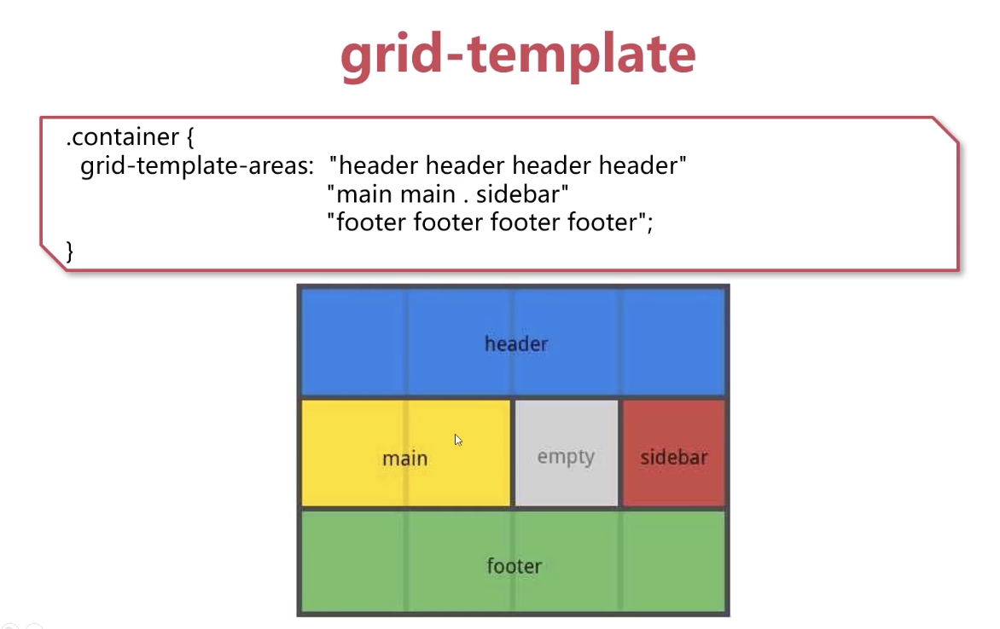

### 笔记记于[此课程](https://www.imooc.com/learn/1111) ###
1. [概念](#ch1)
1. [网格容器的所有属性](#ch2)
1. [网格项的属性](#ch3)
1. [网格中的函数](#ch4)

<br/><a id="ch1"></a>
### 一. 概念 ###
grid布局的优点：可以减少标签的嵌套（两个维度的），写的css代码更有序

1. 
    * 网格容器 display:grid
    * 网格项  网格容器的子元素不管是什么标签都会遵循网格布局，子元素也都叫做网格项
    * 网格线 在创建网格容器的时候就存在了，是虚拟的概念。是组成网格项的分界线 grid Line 

2. 
    * 网格轨道 Grid Track 相邻的网格线之间，称为网格轨道
    * 网格单元 Grid Cell 
    * 网格区域 Grid Area。四个网格线包围的总空间

3. 单位
    * fr 剩余空间分配数。用于在一系列长度值中分配剩余空间，如果多个已指定了多个部分，则剩下的空间根据各自的数字按比例分配
    * gr 网格数

<br/><a id="ch2"></a>
### 二. 网格容器的属性
1. [display](#ch21)
1. [grid-template](#ch22)
1. [gap](#ch23)
1. [items](#ch24)
1. [content](#ch25)
1. [grid-auto](#ch26)
1. [grid](#ch27)

<br/><a id="ch21"></a>
#### 1. display (display:grid | inline-grid | subgrid)
* grid:块级网格
* inline-grid：生成行内网格（不如用flex）

（设置了display后很多属性会无效的，比如column、float、clear、vertical-align等

<br/><a id="ch22"></a>
#### 2. grid-template(Grid-template-columns / Grid-template-rows)
1. **轨道大小**：px、em、%、fr、auto(默认为0，若没有fr单位会找剩下的，若行中为auto或有fr会自动增加行数), (*一般行数都定义为auto*)
1. **网格线名字**,下面代码中 two second 为两个名字，都是指的是列的第二条线
    ```
    .container{
        grid-template-columns:[one] 10% [two second] 200px auto 3fr 2fr;
    }
    ```
1. **网格区域**：通过引用grid-area属性置顶的网格区域的名称来定义网格模板
Grid-template-areas
	* ``<grid-area-name>``设置网格区域的名称
	* . 点号代表一个空网格单元
	* none 没有定一个网格区域


    * 将grid-template三个属性写在一起（**可读性差 不建议**）,其属性值：
        * none：将三个属性都设置为其初始值（初始值为一行、一列、一个区域）
        * subgrid:行、列变成subgrid，区域为一个（不推荐）
        ```
        .container{
            grid-template: none | subgrid | <grid-template-rows> / <grid-template-columns> ;
        }
        ```
<br/><a id="ch23"></a>
#### 3. gap空隙 Grid-column-gap / grid-row-gap
指定网格线的大小，可以想象为设置列/行之间的间距宽度,每行只能做成等长度的控制
1. Grid-column-gap / grid-row-gap指定网格线的大小，可以想象为设置列/行之间的间距宽度,每行只能做成等长度的控制
    ```
    .container{
        grid-column-gap;10px;
        grid-row-gap:10px;
    }
    ```
1. gap简写  Grid-gap / gap ``<grid-row-gap> / <grid-column-gap>``
用gap，为了更好的兼容性，可用grid-gap

<br/><a id="ch24"></a>
#### 4. 所有网格项的配置  items
对齐方式
1. justify-items：沿行轴对齐网格内的内容 start end center stretch(默认值）
1. Align-items  沿列轴对齐 start end center stretch(默认值）

**简写 place-items: 列 行**

<br/><a id="ch25"></a>
#### 5. content
1. Justify-content 设置网格容器内的网格沿着行轴对齐网格的对齐方式
	``start | end | center | stretch | space-around | space-between | space-evenly``
	默认值为start
1. Align-content 列的
1. 简写 place-content 列 行

<br/><a id="ch25"></a>
#### 6. grid-auto 指定自动生成网格轨道的大小（隐式轨道） grid-auto-columns / grid-auto-rows
1. 其生成的条件：在显式的定位超出制定网格范围的行或列时被创建
1. 一般不推荐其使用
1. Grid-auto-flow
	* row
	* column
	*ndense

<br/><a id="ch26"></a>
#### grid  上面所有属性的简写
1. none
1. ``<grid-template-rows> / <grid-template-columns>``
1. …

<br/><a id="ch3"></a>
### 三. 网格项的属性
1. [start / end](#ch31)
1. [grid-area](#ch32)
1. [self](#ch33)

<a id ="ch31"></a>
#### 1. Start / end
1. 使用特定的网格线确定grid item 在网格内的位置
    ```
    .item{
        grid-column-start: <number> | <name> | span <number> | span <name> auto
        grid-column-end:…
        grid-row-start:…
        grid-row-end:…
    }
    ```

    1. ``<number> / <name>``
    1. ``span <number> ``       Span 2 (往后跨两格)
    1. ``Span <name> auto ``    
    
    说明：
	* 如果没有声明grid-column-end / grid-row-end，默认情况下，该网格项将跨越1个轨道
	* 网格项可以相互重叠，可以使用z-index来控制他们的堆叠顺序

1. 简写(**这个好**）grid-column / grid-row
    ```
    .item{
        grid-column: <start-line> / <end-line> | <start-line> / span <value>;
        grid-row:…
    }
    .ss{
        grid-column: 2 / span 2;
    }
    ```
<a id ="ch32"></a>
#### 2. 网格区域grid-area。
1. 给grid item进行命名以便于使用grid-template-areas属性创建模板时来进行引用
    ```
    .item{
        grid-area: <name> | <row-start> / <column-start> / <column-end> / <column-end>
    }
    ```
    * name: 相当于grid-template-areas中定义的命名
    * ``<row-start> / <column-start> / <column-end> / <column-end> ``可以是数字，也可以是网格线的名字

<a id ="ch33"></a>
#### 3. self
这个是控制单个的网格项的
1. Justify-self seart|end|center|stretch
1. Align-self

<br/><a id="ch2"></a>
### 四. 网格布局中的函数
1. [repeat()](#ch41)
1. [fit-content()](#ch42)
1. [minmax()](#ch43)

<a id ="ch41"></a>
#### 1. repeat()重复
1. 跟踪列表的重复片段，允许大量显示重复模式的列货行以更紧凑的形式编写。
1. ``repeat(5, 1fr) === 1fr 1fr 1fr 1fr 1fr``
1. 只能用在``grid-template-columns. Grid-template-rows``
1. ``300px repeart(3, 10% [网格线名称]) 100px repeat(2, 1fr)``
1. 值：
	1. max-content 自适应内容最大的那个单元格	
    1. min-content 自适应内容最小的那个单元格
	1. auto

<a id ="ch42"></a>
#### 2. fit-content()

<a id ="ch43"></a>
#### 3. minmax()
1. ``minmax(最小值， 最大值)``
1. ``Grid-template-columns:minmax(100px, 200px)``
1. ``repeat(5, minmax(200px, 1fr))``
1. ``repeat(auto-fill, minmax(100px, 150px))``根据网格容器的大小，能重复多少个网格项(**>=**)
1. ``repeat(auto-fit, minmax(100px, 150px))``根据网格项来确定会有多少个网格项（**<=**)